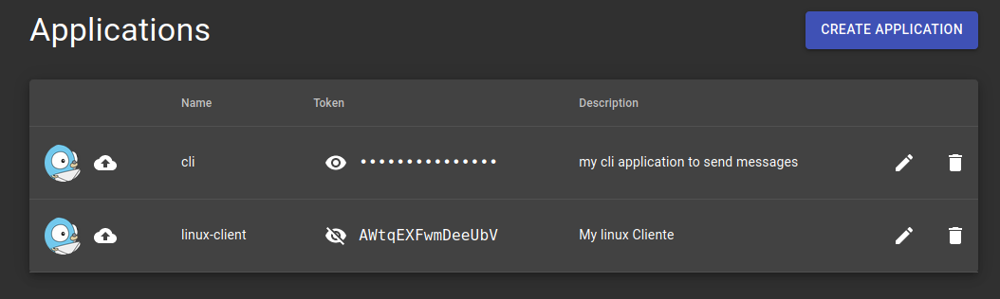
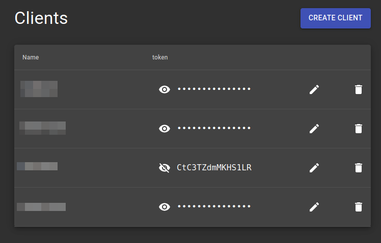
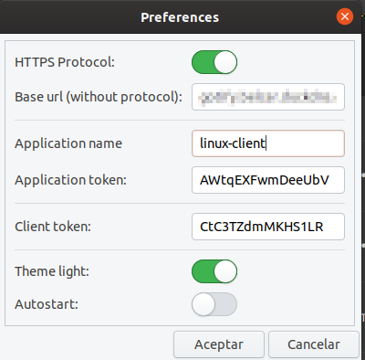

<h1 align="center">Welcome to Gotify Indicator 👋</h1>


[](https://www.codacy.com/manual/atareao/Gotify-Indicator?utm_source=github.com&amp;utm_medium=referral&amp;utm_content=atareao/gotify-indicator&amp;utm_campaign=Badge_Grade)
[](https://www.codefactor.io/repository/github/atareao/gotify-indicator/overview/master)

[](https://twitter.com/atareao)

Gotify Indicator is an application to recieve and send messages from your own Gotify Server.

[](https://www.atareao.es/aplicacion/gotify-indicator/)

## 🏠 [Homepage](https://www.atareao.es/applicacion/gotify-indicator)

## Prerequisites

Before you begin, ensure you have met the following requirements:

* If you install it from PPA don't worry about, becouse all the requirements are included in the package
* If you clone the repository, you need, at least, these dependecies,

```
python3
gir1.2-gtk-3.0
gir1.2-glib-2.0
gir1.2-gdkpixbuf-2.0
gir1.2-appindicator3-0.1
gir1.2-notify-0.7
```

## Installing Gotify-Indicator

To install **Gotify-Indicator**, follow these steps:

* In a terminal (`Ctrl+Alt+T`), run these commands

```
sudo add-apt-repository ppa:atareao/atareao
sudo apt update
sudo apt install gotify-indicator
```

## Using Gotify Indicator

To use **Gotify Indicator**, open it, and configure it. First, create an application in the Gotify web. Write down, application name and application token.



Create a client in the Gotify web. Write down, client token



In the configuration of Gotify Indicator set the token for the application and the client



## Contributing to Gotify Indicator

To contribute to **Gotify Indicator**, follow these steps:

1. Fork this repository.
2. Create a branch: `git checkout -b <branch_name>`.
3. Make your changes and commit them: `git commit -m '<commit_message>'`
4. Push to the original branch: `git push origin <project_name>/<location>`
5. Create the pull request.

Alternatively see the GitHub documentation on [creating a pull request](https://help.github.com/en/github/collaborating-with-issues-and-pull-requests/creating-a-pull-request).

## 👤 Contributors ✨

Thanks goes to these wonderful people ([emoji key](https://allcontributors.org/docs/en/emoji-key)):

<!-- ALL-CONTRIBUTORS-LIST:START - Do not remove or modify this section -->
<!-- prettier-ignore-start -->
<!-- markdownlint-disable -->
<table>
  <tr>
    <td align="center"><a href="https://www.atareao.es"><br /><sub><b>Lorenzo Carbonell</b></sub></a><br /><a href="https://github.com/atareao/fondos-productivos/commits?author=atareao" title="Code">💻</a></td>
    <td align="center"><a href="https://github.com/albanobattistella"><br /><sub><b>albanobattistella</b></sub></a><br /><a href="https://github.com/atareao/gotify-indicator/commits?author=albanobattistella" title="Code">💻</a></td>
  </tr>
</table>

<!-- markdownlint-enable -->
<!-- prettier-ignore-end -->
<!-- ALL-CONTRIBUTORS-LIST:END -->

This project follows the [all-contributors](https://github.com/all-contributors/all-contributors) specification. Contributions of any kind welcome!

## Contact

If you want to contact me you can reach me at [atareao.es](https://www.atareao.es).

## License

This project uses the following license: [MIT License](https://choosealicense.com/licenses/mit/).
